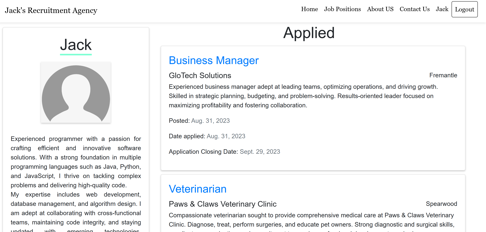

# RecruitmentWebsite
This project is a Django based website which allows users to view job listings, apply for jobs and create a user account for uploading resumes and a bio.

Home Page

Available Job Positions

Job Position Details

Login

Job Application Confirmed

Profile Page

Update Profile

About Page

Contact Page

